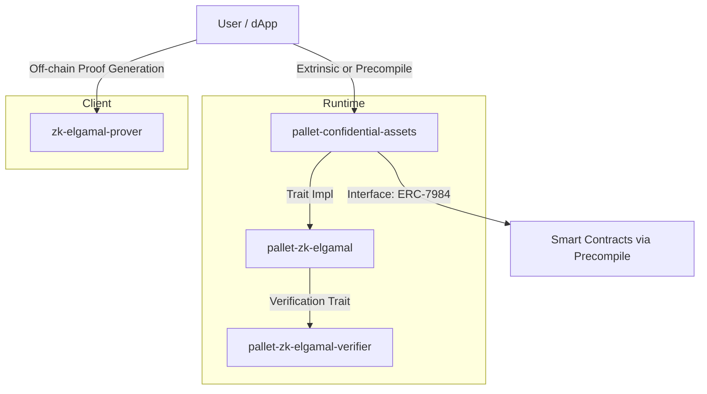

# Confidential Assets Design

## Overview

The Confidential Assets project brings OpenZeppelin’s **ERC-7984 Confidential Contracts Interface** to the Polkadot ecosystem.  
It enables **encrypted on-chain transfers with verifiable correctness** while preserving address transparency.  
The system is composed of modular Substrate pallets and cryptographic libraries organized as follows:

**`pallet-confidential-assets`** — Implements ERC-7984-compatible confidential transfer and mint/burn interfaces. Uses a **pluggable cryptographic backend** assigned at runtime to `pallet-zk-elgamal`.
**`pallet-zk-elgamal`** — Manages runtime state and proof validation for encrypted amounts using a **ZK-ElGamal** backend. It exposes no direct extrinsics; its functionality is accessed via trait implementations consumed by `pallet-confidential-assets`.
**`pallet-zk-elgamal-verifier`** — Provides `no_std` proof verification logic used exclusively by `pallet-zk-elgamal`.
**`zk-elgamal-prover`** — Client-side library used by off-chain actors (e.g., wallets, relayers, or Substrate RPC clients) to generate proofs expected by the runtime.
**Primitives crates** — Contain shared curve definitions, serialization helpers, and traits reused between pallets and the prover/verifier implementations.

This design ensures separation of **runtime logic**, **proof verification**, and **client-side proving**, making the system extensible, auditable, and cryptographically sound.

---

## Architecture

Flow summary
A user calls into pallet-confidential-assets.
The pallet delegates verification and storage operations to pallet-zk-elgamal.
pallet-zk-elgamal validates proofs through its runtime-assigned verifier implementation (pallet-zk-elgamal-verifier).
The corresponding proofs are generated off-chain by the zk-elgamal-prover library.
Frontier precompiles expose the same logic to EVM contracts.
Later, PolkaVM precompiles will provide native contract access.

⸻

Design Trade-offs and Rationale

Choice of ZK-ElGamal Backend

The ZK-ElGamal scheme was selected for its close alignment with the ERC-7984 Confidential Contracts standard and its proven use in Solana’s Confidential Token implementation.

Advantages
	•	Address transparency: Sender and receiver remain visible, satisfying regulatory and interoperability constraints while keeping transfer amounts confidential.
	•	Verifiable execution: Zero-knowledge proofs guarantee that encrypted transfers preserve balance correctness without revealing plaintext amounts.
	•	Account model compatibility: Works naturally with Substrate’s account-based state and existing asset registries, avoiding UTXO complexity.
	•	Extensibility: Better suited for composable systems, account abstraction, and future programmable privacy use cases compared to MimbleWimble-style designs.
	•	Proven production precedent: Mirrors Solana’s Confidential Token architecture, leveraging the same twisted ElGamal + Pedersen commitment combination for efficient on-chain verification.

Compared to MimbleWimble
	•	MimbleWimble hides sender and receiver information, making it unsuitable for general-purpose on-chain use or composable smart contract environments.
	•	MimbleWimble’s cut-through model favors off-chain transaction aggregation rather than real-time execution and event emission expected in ERC-compatible systems.
	•	ZK-ElGamal provides deterministic, verifiable encrypted transactions that integrate smoothly with runtime logic, governance, and cross-chain standards.

⸻

Implementation Risks and Mitigations

Risk	Description	Mitigation
Cryptographic correctness	Incorrect elliptic-curve definitions, domain parameters, or point decompression logic could cause consensus divergence or asset loss.	Seek early review from OpenZeppelin internal experts and external cryptographers; reuse proven libraries (e.g., curve25519-dalek); add extensive property tests.
no_std verification bugs	Limited runtime debugging and serialization complexity may cause subtle verification mismatches.	Maintain symmetry tests between zk-elgamal-prover and pallet-zk-elgamal-verifier; integrate CI pipelines for cross-checking proof/verification pairs.
Proof size and weight overhead	On-chain verification may increase block weight and storage usage.	Use benchmark-driven optimization; parameterize proof size limits via runtime constants.
Cross-pallet coupling	Tight coupling between pallet-confidential-assets and pallet-zk-elgamal could complicate upgrades.	Maintain backend abstraction traits; use feature gating and versioned trait interfaces.

⸻

Timeline

Phase	Milestone	Description	Timeline
Phase 1	pallet-zk-elgamal + pallet-zk-elgamal-verifier	Implement verifier backend with working proof roundtrip tests.	Oct 21 – Oct 27
Phase 2	pallet-confidential-assets	Integrate backend and expose ERC-7984 extrinsics.	Oct 28 – Nov 3
Phase 3	zk-elgamal-prover	Implement client-side proof generation; align API with verifier expectations.	Nov 4 – Nov 10
Phase 4	pallet-xcm-confidential-bridge	Implement cross-chain encrypted transfer bridge demo for Sub0 (deadline: Nov 14).	Nov 11 – Nov 14
Phase 5	Frontier precompile	Expose pallet-confidential-assets functionality to EVM smart contracts.	Nov 15 – Nov 28
Phase 6	PolkaVM precompile	Extend runtime accessibility for native contracts (post-Sub0).	Nov 29 – Dec 12
Phase 7	Audit & Review	Engage OpenZeppelin and independent auditors for full cryptographic and runtime review.	Dec 13 – Dec 26
Phase 8	Testing & Integration with AssetHub	Final testnet deployment and proposal for permanent inclusion in AssetHub.	Dec 27 – Jan 9

⸻

## Future Extensions

The following modules represent future extensions of the confidential framework.
They are listed here for repository scope planning and naming consistency only.
	•	pallet-confidential-airdrop
	•	pallet-confidential-dex
	•	pallet-confidential-perp-dex
	•	pallet-confidential-nfts
	•	pallet-confidential-tickets
	•	pallet-confidential-auction
	•	pallet-confidential-voting

Primitive cryptographic pallets supporting these extensions include (but are not limited to):
	•	pallet-merkle-tree
	•	pallet-kite-vote
	•	pallet-kite-snapshot

These extensions may justify consolidation under `openzeppelin-polkadot-zk`. The new repository may include a template with all of its functionality configured without bloating the other templates with additional feature flags and code paths (`openzeppelin-polkadot-zk/template`).